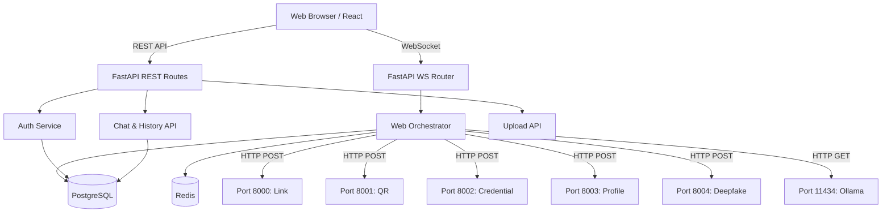

# Deep Analysis: aegis-web

## 1. SERVICE OVERVIEW
- **Service Name:** `aegis-web`
- **Purpose:** Primary user-facing web application and API gateway for the Aegis AI ecosystem.
- **Responsibility:** Orchestrating user requests, providing a real-time conversational interface, managing user authentication and sessions, and routing specialized analysis tasks (links, deepfakes, profiles, etc.) to the appropriate backend microservices.
- **Inputs:** User chat messages, images, and videos via web interface.
- **Outputs:** Real-time chat responses with formatted security analysis, risk levels, and follow-up actions.
- **Intended Consumers:** End users seeking cybersecurity analysis through a web browser.
- **Dependencies:** PostgreSQL, Redis, Ollama (for AI explanations).
- **External Services:** Aegis Microservices (Link Analyzer, QR Scanner, Deepfake API, Credential Analyzer, Profile Analyzer).

## 2. COMPLETE FEATURE INVENTORY
- **Real-time Chat Interface:** WebSocket-based streaming chat with "thinking" indicators and structured message rendering.
- **User Authentication:** Email/password registration, JWT-based login, refresh tokens, password resets, and email verification.
- **Guest Mode:** Allows unauthenticated users to interact with the chat with temporary sessions.
- **Session Management:** Persistent chat history across sessions, session renaming, and archiving.
- **Scan History & Statistics:** Tracks previous scans, maintaining a 30-day anonymized log, and displays statistics in a sidebar.
- **File Uploads:** Supports image and video uploads (up to 25MB) for QR and Deepfake analysis.
- **Intent Classification & Orchestration:** Analyzes natural language input to determine the required security check and automatically routes it.
- **Interactive Follow-ups:** Provides clickable "chips" (quick replies) based on the context of the previous scan to guide the user.
- **Rate Limiting:** Protects the API from abuse using Redis-backed rate limiting.

## 3. COMPLETE TECHNOLOGY STACK
### Frontend
- **React 18:** UI library.
- **Vite:** Build tool and dev server.
- **TypeScript:** Type-safe JavaScript.
- **TailwindCSS (v3.4) & PostCSS:** Styling and utility classes.
- **Zustand:** State management (`authStore`, `chatStore`).
- **React Router DOM:** Client-side routing.
- **Axios:** HTTP client for REST APIs.
- **React Markdown:** Rendering formatted bot responses.
- **React Hot Toast:** Toast notifications.
- **Lucide React:** Icons.

### Backend
- **FastAPI:** High-performance web framework.
- **Uvicorn:** ASGI server.
- **Python 3.11:** Runtime environment.
- **SQLAlchemy (async) & asyncpg:** ORM and asynchronous PostgreSQL driver.
- **Alembic:** Database migrations.
- **Redis (redis-py):** In-memory data store for session state and rate limiting.
- **python-jose:** JWT generation and validation (uses stdlib PBKDF2 for password hashing).
- **Pydantic:** Data validation and settings management.
- **python-multipart & aiofiles:** File upload handling.
- **httpx:** Asynchronous HTTP client for communicating with microservices.
- **aiosmtplib:** Asynchronous SMTP client for sending emails.

## 4. ARCHITECTURE
The service follows a full-stack client-server architecture with a gateway pattern for microservices.

## 5. API DOCUMENTATION
### WebSocket Endpoints
- **`WS /ws/chat`**
  - **Purpose:** Primary chat interface.
  - **Input:** JSON messages (`{"type": "message", "session_id": "...", "content": "..."}`).
  - **Output:** Streaming chunks, "thinking" states, and final result JSONs.

### REST Endpoints
**Auth**
- **`POST /api/auth/login`**: Authenticate user, returns Access/Refresh tokens.
- **`POST /api/auth/register`**: Create new account.
- **`POST /api/auth/logout`**: Revoke refresh token.
- **`POST /api/auth/refresh`**: Get new access token.
- **`GET /api/auth/me`**: Get current user profile.
- **`POST /api/auth/verify-email`**: Verify email via token.
- **`POST /api/auth/forgot-password`**: Initiate password reset.
- **`POST /api/auth/reset-password`**: Complete password reset.

**Chat & History**
- **`GET /api/chat/sessions`**: List user chat sessions.
- **`GET /api/chat/sessions/{sid}`**: Get session details and messages.
- **`PATCH /api/chat/sessions/{sid}`**: Rename a session.
- **`DELETE /api/chat/sessions/{sid}`**: Archive a session.
- **`GET /api/history/30days`**: Get 30-day anonymized scan log.
- **`GET /api/history/stats`**: Get statistics for the dashboard.

**Uploads**
- **`POST /api/upload/image`**: Upload JPEG/PNG/WebP/GIF (Max 25MB). Returns `media_id`.
- **`POST /api/upload/video`**: Upload MP4/MOV/AVI (Max 25MB). Returns `media_id`.

## 6. CORE LOGIC
**Chat Orchestration (`web_orchestrator.py`):**
1. **Receive:** User sends text or `media_id` via WebSocket.
2. **State & Rate Limit:** Check Redis for rate limits; load session from PostgreSQL.
3. **Extraction & Classification:** Run NLP extraction (URLs, emails, phones) and intent classification to decide the route (e.g., `Module.LINK`, `Module.DEEPFAKE`).
4. **Dispatch:** Send data via `httpx` to the specific microservice.
5. **Streaming:** While waiting, yield `{"type": "thinking"}` events to the frontend.
6. **Explanation:** Pass the microservice result to Ollama for a human-readable explanation.
7. **Formatting:** Format the final output using specific formatters.
8. **Result:** Send the final `{"type": "result"}` payload to the frontend.
9. **Persistence:** Save the user message and bot response to the database.

## 7. DATA
**PostgreSQL Entities:**
- `User`: id, email, password_hash, display_name, email_verified, is_active.
- `ChatSession`: id, user_id, title, is_archived.
- `Message`: id, session_id, role (`user`/`bot`), content, structured (JSONB), module_used, risk_level, media_url, media_type.
- `RefreshToken`: id, user_id, token_hash, expires_at, is_revoked.
- `ScanHistory`: id, user_id, value_hash (first 16 chars for privacy), entry_type, verdict, risk_level, scanned_at, expires_at.

## 8. ERROR HANDLING & VALIDATION
- **Input Validation:** Pydantic models validate REST API payloads.
- **Upload Validation:** Validates MIME types and enforces a 25MB size limit.
- **Service Outages:** `httpx` calls use timeouts (usually 30s-60s). If a microservice is offline, the orchestrator gracefully catches `ConnectError` and informs the user via the chat interface without crashing.
- **Frontend Fallbacks:** React Error Boundaries (`RouteError`) catch render crashes. Missing WebSockets trigger auto-reconnects.

## 9. SECURITY
- **Authentication:** Dual-token JWT architecture. Access tokens live in memory/sessionStorage (sent via headers), refresh tokens in localStorage.
- **Passwords:** Hashed using PBKDF2 (stdlib) to avoid binary dependency issues.
- **Privacy:** `ScanHistory` only stores a truncated hash of the scanned value to protect PII.
- **Rate Limiting:** Redis-backed rate limiter restricts messages per minute per user.
- **CORS:** Restricts API access to defined frontend origins.

## 10. TESTING
- **Backend:** A `tests/` directory and `pytest.ini` are present, configured for `pytest` and `pytest-asyncio`.
- **Coverage:** Actual coverage levels are unknown without running the test suite.

## 11. DOCKER & DEPLOYMENT
- **Backend Dockerfile:** Uses `python:3.11-slim`. Installs `build-essential` and `libpq-dev` for `asyncpg`. Runs Uvicorn on port 8007.
- **Environment:** Relies on `.env.web` for configuration.
- **Docker Compose:** Integrates via `docker-compose.web.yml`, assuming internal Docker networking (`host.docker.internal` used for accessing host-bound microservices).

## 12. INTEGRATION WITH THE REST OF AEGIS
`aegis-web` acts as the central hub and connects to all other Aegis analyzers via HTTP POST requests:
- **This Service → Link Analyzer (`8000`)**: `POST /scan` (Sends URLs for threat analysis).
- **This Service → QR Scanner (`8001`)**: `POST /scan-base64` (Sends base64 images to decode and check URLs).
- **This Service → Credential Analyzer (`8002`)**: `POST /analyze/*` (Sends emails, passwords, cards, CNIC, etc., for breach and validity checks).
- **This Service → Profile Analyzer (`8003`)**: `POST /analyze/profile` (Sends social media handles for risk scoring).
- **This Service → Deepfake API (`8004`)**: `POST /analyze/image` or `video` (Sends multipart files for AI manipulation detection).
- **This Service → Ollama (`11434`)**: `GET /api/tags` and prompt generation (For human-readable explanations of technical scan results).

## 13. PROJECT STRUCTURE
- `backend/app/api/`: FastAPI routers (auth, chat, upload, ws_handler).
- `backend/app/core/`: Configuration, database setup, security utilities.
- `backend/app/models/`: SQLAlchemy ORM definitions.
- `backend/app/schemas/`: Pydantic models for validation.
- `backend/app/services/`: Dispatcher logic and Web Orchestrator.
- `backend/app/services_logic/`: Domain-specific intelligence engines (likely adapted from the WhatsApp bot).
- `frontend/src/api/`: Axios client wrappers.
- `frontend/src/components/`: React UI components (Chat layout, message bubbles).
- `frontend/src/pages/`: Main application views.
- `frontend/src/stores/`: Zustand state management.

## 14. TECHNICAL ACHIEVEMENTS
- **Complex Orchestration:** Successfully adapts an intent-based chat routing system to a streaming WebSocket interface.
- **Graceful Degradation:** Handles microservice downtime elegantly without breaking the main user experience.
- **Privacy-Conscious Data Modeling:** Implementation of truncated hashing for storing scan history without exposing PII.

## 15. PORTFOLIO RELEVANCE
- **Strongest Feature:** The `web_orchestrator.py` and WebSocket integration. It demonstrates a strong grasp of asynchronous programming, real-time communication, and managing complex multi-service workflows.
- **Architecture:** The clear separation of concerns (React frontend, FastAPI gateway, specific microservices) highlights mature system design capabilities.

## 16. LIMITATIONS / UNKNOWN INFORMATION
- **Frontend Testing:** No explicit test framework (like Jest or Cypress) was observed in the frontend configuration.
- **Code Duplication:** The `services_logic` folder contains a `COPY_FROM_WA_PROJECT.md` file, indicating that logic might be duplicated between the web and WhatsApp interfaces rather than extracted into a shared library.

## 17. EVIDENCE & CONFIDENCE
- **Verified:** Tech stack, database models, WebSocket streaming, microservice ports/endpoints, frontend state management. (Directly read from source files).
- **Strongly Inferred:** Test suite execution (presence of `pytest.ini`), Docker deployment strategies.
- **Unknown:** Actual test coverage percentage, full scope of shared logic vs. duplicated logic with the WhatsApp project.
