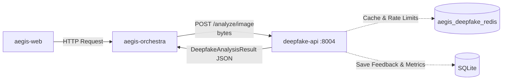

# TASK — Deep Analysis of deepfake-api

## 1. SERVICE OVERVIEW

**Service Name**: Deepfake Detection API (Aegis AI — Deepfake Detection API v3.0.0)

**Purpose**: To provide specialized, high-accuracy analysis of images and videos to detect deepfake manipulation, AI generation, and digital alterations.

**Problem it Solves**: Identifies whether media (images or videos) submitted to the Aegis AI system is genuine or manipulated, thereby preventing misinformation, fraud, and identity spoofing.

**Responsibility within Aegis AI**: Acts as the dedicated Deepfake media analysis engine. It runs heavily optimized multi-model ensembles to return structured risk assessments (probabilities, verdicts, confidence) for media assets sent from the Aegis Orchestrator or Aegis Web interfaces.

**Inputs**:
- Images: Raw file uploads (JPEG, PNG, WebP, BMP) or publicly accessible image URLs.
- Videos: Raw file uploads (MP4, etc.) via synchronous or asynchronous endpoints.
- Headers: `X-Source-Hint` (e.g., `whatsapp`) to trigger specific preprocessing logic (e.g., compensating for compression).
- Metadata: API Keys for security.

**Outputs**:
- JSON responses adhering to the `DeepfakeAnalysisResult` schema, which includes `overall_risk_score`, `overall_risk_level`, `verdict` (e.g., "FAKE", "REAL", "UNCERTAIN"), `confidence_score`, flags, per-model scores, face data, and optionally timeline or GradCAM heatmaps.
- Async endpoints return `AsyncJobResponse` and `JobStatusResponse`.
- Batch endpoint returns `BatchImageResult`.

**Main Capabilities**:
- Multi-face image deepfake detection (analyzing up to 4 faces independently).
- Video deepfake detection using spatial, temporal, and frequency components.
- Explainability (GradCAM heatmaps for images).
- Timeline generation for videos (per-second frame analysis).
- Asynchronous video processing (non-blocking).
- Persistent feedback loop collection for future model re-training.
- Automatic compression compensation for WhatsApp media.

**Intended Consumers/Users**:
- The `aegis-orchestra` service (which calls it at `http://host.docker.internal:8004`).
- The `aegis-web` frontend (which may interface directly or via the orchestrator for `8004`).

**Dependencies & External Services**:
- A dedicated Redis container (`aegis_deepfake_redis`) for caching analysis results, managing async jobs, and rate-limiting.
- Pre-trained PyTorch models (EfficientNet, ViT, FreqCNN, SpatialCNN, TemporalTransformer, FrequencySRMCNN) loaded locally.

---

## 2. COMPLETE FEATURE INVENTORY

**Major Features**:
- **Image Analysis** (`/analyze/image`): Multi-model ensemble inference on a single uploaded image. Uses EfficientNet, ViT, and FrequencyCNN.
- **Image URL Analysis** (`/analyze/image-url`): Downloads an image from a URL and analyzes it.
- **Video Analysis (Synchronous)** (`/analyze/video`): Synchronous analysis of video files. Uses Spatial CNN, Temporal Transformer, and Frequency SRM CNN.
- **Video Analysis (Asynchronous)** (`/analyze/video-async` & `/analyze/status/{job_id}`): Queues a video for background processing and allows status polling to avoid HTTP timeouts on large files.
- **Batch Image Analysis** (`/analyze/batch`): Processes up to 10 images concurrently.
- **Image Explainability** (`/analyze/image/explain`): Generates a GradCAM heatmap overlaid on the analyzed face, highlighting manipulated regions.
- **Video Timeline** (`/analyze/video/timeline`): Analyzes a video and returns a per-second deepfake probability breakdown.
- **Caching**: Stores image analysis results and async video jobs in Redis with TTL.

**Minor Features**:
- **Rate Limiting**: Sliding window rate-limiter backed by Redis (or memory fallback), configurable per endpoint.
- **Quality Gate**: Prevents processing of images/videos without faces or with extreme blur/low resolution. Rejects non-face inputs (QR codes, logos).
- **Source-Hint Preprocessing**: Enhances media compressed by WhatsApp (`X-Source-Hint: whatsapp`) using a light unsharp mask.
- **Multi-face Evaluation**: Detects up to 4 faces in an image using Non-Maximum Suppression (NMS), analyzes each independently, and bases the final verdict on the highest-risk face.
- **Health & Metrics endpoints**: Exposes `/health`, `/metrics`, and `/metrics/prometheus` for monitoring models loaded, GPU availability, and cache stats.
- **Feedback Loop**: `/feedback` endpoint allows users/systems to report false positives/negatives, which are saved in a local SQLite database (`feedback.db`).
- **5-Rule Ensemble Logic**: Uses a custom confidence scoring mechanism that overrides the weighted average with sharp rules (e.g., if any model score is <= 60% for video, cap toward REAL).

**Utilities**:
- OpenCV-based Haar Cascade and Dlib face detection.
- Fast Fourier Transform (FFT) magnitude spectrum extraction for Frequency CNNs.
- `mock_torch.py` and `generate_synthetic_assets.py` for testing.

---

## 3. COMPLETE TECHNOLOGY STACK

- **Programming Language**: Python 3.11
- **Framework**: FastAPI (Web framework), Uvicorn (ASGI Server)
- **Machine Learning & AI**:
  - `torch` (PyTorch) - Core deep learning framework for inference.
  - `timm` (PyTorch Image Models) - Backbone definitions for EfficientNet and ViT.
  - `numpy` - Tensor and numerical manipulations.
- **Computer Vision**:
  - `cv2` (OpenCV, via `libsm6`, `libxext6`, etc. in Docker) - Face detection (Haar Cascades), resizing, cropping, unsharp masking, and video frame extraction.
  - `dlib` (Optional, dynamically imported) - Fallback high-accuracy face detection.
- **Database / Storage**:
  - `redis` - Used for caching `DeepfakeAnalysisResult`, storing async job state, and rate-limiting.
  - `sqlite3` - Standard library module used to store persistent user feedback and scan logs (`data/feedback.db`).
- **Data Validation**: `pydantic`, `pydantic-settings`
- **HTTP Client**: `httpx` (for downloading image URLs asynchronously).
- **Concurrency**: `asyncio`, `threading` (background jobs for video analysis, non-blocking ThreadPoolExecutor for heavy tasks).
- **Testing**: `pytest`
- **Deployment**:
  - `docker` and `docker-compose`
  - Runs with `uvicorn --workers 4`

---

## 4. ARCHITECTURE

### Main Modules
- `app.main`: FastAPI application initialization, CORS, Lifespan (loading models & DB), and API route definitions.
- `app.schemas`: Pydantic models mapping the input/output contracts.
- `app.config`: Pydantic settings loading from `.env`.
- `app.analyzers`:
  - `image_analyzer.py`: Image analysis orchestration, orchestrates face detection, preprocessing, and ensemble inference.
  - `video_analyzer.py`: Video frame extraction, batch processing, temporal sequence generation, and video ensemble inference.
  - `gradcam.py`: Explains CNN decisions via Gradient-weighted Class Activation Mapping.
- `app.models`:
  - `image_models.py`: Defines PyTorch classes for `DeepfakeEfficientNetB4`, `DeepfakeViT`, `DeepfakeFreqCNN`.
  - `video_models.py`: Defines PyTorch classes for `SpatialCNN`, `TemporalTransformer`, `FrequencySRMCNN`.
  - `ensemble.py`: Loads checkpoints, constructs `EnsembleState`, runs the 5-rule heuristic scoring logic (`five_rule_ensemble`), and dynamically assigns inference devices.
- `app.utils`:
  - `face_detector.py`: Wraps Haar Cascades (and Dlib) with Non-Maximum Suppression (NMS).
  - `preprocessing.py`: Implements precise logic that mimics training-time transforms (FFT extraction, ImageNet normalization, temporal sequence chunking).
  - `quality_gate.py`: Rejects inputs lacking faces or failing blur/size thresholds.
  - `rate_limiter.py`: Redis-based sliding window rate-limiter.
  - `redis_client.py`: Lazy connection manager for Redis, manages caching and jobs.
  - `feedback_store.py`: SQLite wrapper for storing analytics and retraining feedback.

### Processing Pipeline (Image Example)
1. **Entry**: Endpoint receives image bytes and optional `source_hint`.
2. **Cache Check**: If enabled, queries Redis.
3. **Pre-processing**: Decoded to BGR. If hint is "whatsapp", an unsharp mask is applied.
4. **Quality Gate & Detection**: Ensures an acceptable face exists. Uses NMS to locate up to 4 faces.
5. **Ensemble Execution**:
   - Resized to 224x224 RGB and normalized for EfficientNet/ViT.
   - Converted to 128x128 FFT magnitude spectrum for FrequencyCNN.
   - Run through all three PyTorch models.
6. **Scoring**: Base probabilities are merged via custom `five_rule_ensemble`, scaled to a risk level and confidence score.
7. **Storage**: Cached in Redis; metrics logged to SQLite.
8. **Response**: JSON returned.

---

## 5. API DOCUMENTATION

| Method | Endpoint | Purpose | Inputs | Outputs |
|---|---|---|---|---|
| **GET** | `/` | System info. | None | JSON with version, available endpoints. |
| **GET** | `/health` | System health check. | None | `HealthResponse`: Models loaded, GPU, Redis status. |
| **POST** | `/analyze/image` | Image deepfake analysis. | `file` (UploadFile), `X-Source-Hint` header, `X-API-Key` | `DeepfakeAnalysisResult` JSON. |
| **POST** | `/analyze/image-url` | Image deepfake analysis from URL. | Body `ImageURLRequest` (url, source_hint), `X-API-Key` | `DeepfakeAnalysisResult` JSON. |
| **POST** | `/analyze/video` | Synchronous video analysis. | `file` (UploadFile), `X-Source-Hint` header, `X-API-Key` | `DeepfakeAnalysisResult` JSON. |
| **POST** | `/analyze/video-async` | Asynchronous video analysis. | `file` (UploadFile), `X-Source-Hint` header, `X-API-Key` | `AsyncJobResponse` JSON (job_id, poll_url). |
| **GET** | `/analyze/status/{job_id}` | Poll async video job. | `job_id` | `JobStatusResponse` JSON. |
| **POST** | `/analyze/batch` | Analyze multiple images (max 10). | `files` (List[UploadFile]), `X-Source-Hint` header, `X-API-Key` | `BatchImageResult` JSON. |
| **POST** | `/analyze/image/explain` | Image analysis with GradCAM heatmap. | `file` (UploadFile), `X-Source-Hint` header, `X-API-Key` | `DeepfakeAnalysisResult` JSON (includes `gradcam_heatmap` base64). |
| **POST** | `/analyze/video/timeline` | Video analysis with per-second timeline. | `file` (UploadFile), `X-Source-Hint` header, `X-API-Key` | `DeepfakeAnalysisResult` JSON (includes `timeline`). |
| **POST** | `/feedback` | Submit analysis correction. | Body `FeedbackRequest` | `FeedbackResponse` JSON. |
| **GET** | `/feedback/stats` | View feedback accumulation. | None | JSON of SQLite feedback counts. |
| **GET** | `/cache/stats` | View Redis memory stats. | None | JSON of Redis stats. |
| **DELETE** | `/cache/purge` | Clear Redis cache/jobs. | None | JSON count of purged keys. |
| **GET** | `/metrics` | API internal metrics. | None | JSON scan/hit metrics. |
| **GET** | `/metrics/prometheus` | Prometheus formatted metrics. | None | PlainText Prometheus metrics. |

---

## 6. CORE LOGIC

### Video Analysis Speed Optimization
To prevent long blocking periods:
- **Frame extraction**: Video read locally via OpenCV, extracting frames down to `VIDEO_FPS_EXTRACT` (default 1 fps). Max capped at 45 frames.
- **Face Detection**: Run only every 5th frame; the bounding box is reused for the next 4 frames to save compute.
- **Real-Override Logic**: If *any* single video model yields <= 60% probability of a fake, the overall ensemble score is forcibly capped to REAL / LIKELY_REAL with an adjusted high confidence. Only when all three models exceed 60% can the result be marked as FAKE.

### Image Multi-Face Logic
- Every detected face (up to 4) is cropped and processed entirely through the neural networks.
- A report of every face's score is generated.
- The *final verdict* (and GradCAM generation if requested) is dictated by the highest-risk (most manipulated) face found in the image.

### 5-Rule Ensemble (`five_rule_ensemble`)
A heuristic system that overrides a simple weighted average to handle edge cases:
1. **Rule1 (≥90%)**: If any model is very confident it's fake, it re-weights heavily to favor that model.
2. **Rule2 (<10%)**: If any model is extremely confident it's real, the score drops drastically.
3. **Rule3 (≥80%)** & **Rule4 (≤20%)**: Re-weights moderately to respect strong signals.
4. **Rule5 (avg)**: If all models are uncertain, returns the standard weighted average.

---

## 7. DATA

**Data Models / Output Schemas**:
- `DeepfakeAnalysisResult`: The standard contract. Contains `scan_id`, `overall_risk_score` (0-100), `overall_risk_level`, `verdict` (REAL, LIKELY_REAL, UNCERTAIN, LIKELY_FAKE, FAKE), `confidence_score`, `per_model_scores`, `face_info` (counts, dimensions), `input_quality`, `all_flags` (list of text warnings), and `elapsed_ms`.
- **Database (`data/feedback.db`)**:
  - `feedback` table: Stores `scan_id`, `original` verdict, `corrected` verdict, notes, pipeline, p_fake.
  - `scan_log` table: Logs every scan's verdict, risk score, and performance (time taken, cache hit).

**Input Formats**:
- Uses `multipart/form-data` for file uploads. Images and videos are read completely into memory (`await file.read()`), save for videos in `/analyze/video` where they are pushed to a `tempfile` during analysis.

---

## 8. ERROR HANDLING & VALIDATION

- **Quality Gate (`run_quality_gate`)**: If the image contains no faces or is heavily corrupted, it immediately skips the PyTorch pipeline and returns a pseudo-`DeepfakeAnalysisResult` with verdict `UNAVAILABLE` and status `poor`.
- **API File Validation**: If empty files are sent, HTTP 400 is returned. If video size exceeds `MAX_VIDEO_SIZE_MB`, HTTP 413 Payload Too Large is returned.
- **Fail-safes**: Deep learning inference is wrapped in `try-except` blocks. If one PyTorch model fails (e.g. out of memory on GPU), its individual score is defaulted to `0.5`, allowing the ensemble to proceed gracefully.
- **Redis Degradation**: If Redis is offline, the API does not crash. Caching is silently bypassed, and Async Jobs fall back to an in-memory dictionary bounded to 500 items.

---

## 9. SECURITY

- **Authentication**: Validates the `X-API-Key` header against `API_KEY` from the `.env` file (if configured).
- **Rate Limiting**: Sliding window rate-limiter prevents brute forcing. Configured strictly (e.g., 5 requests/min for video, 30 requests/min for image).
- **CORS**: Correctly configured with `allow_origins=["*"]` and `allow_credentials=False` to prevent browser blockages while maintaining loose restrictions for cross-service calls.
- **Input Sanitization**: OpenCV functions inherently act as sanitizers. Malicious bytes that are not valid decodable media formats raise errors cleanly.
- **File Handling Limitations**: Max video upload is theoretically capped by `MAX_VIDEO_SIZE_MB` (currently set excessively high: `99999` in docker-compose, but logic is present to enforce it).

---

## 10. TESTING

- **Testing Directory (`tests/`)**: High coverage is implied by the presence of 12 files.
- Contains unit and integration tests: `test_image_analysis.py`, `test_video_analysis.py`, `test_ensemble_rules.py`, `test_quality_gate.py`, etc.
- **Mocks**: Uses a custom `mock_torch.py` to simulate the PyTorch API surface area, allowing tests to run in environments without heavy model weights or actual GPUs.
- **Assets**: Synthetic test assets can be generated via `scripts/generate_synthetic_assets.py`.

---

## 11. DOCKER & DEPLOYMENT

- **Dockerfile**: Uses `python:3.11-slim`. Installs required C-libraries for OpenCV (`libglib2.0-0`, `libsm6`, `libxext6`, `libgl1`).
- **Server Startup**: Runs via `uvicorn app.main:app` with `--workers 4` and a high `--timeout-keep-alive 600`. The 4 workers ensure that a long, synchronous deepfake scan does not completely choke the server for other requests.
- **Docker Compose**: Sets up the API and its dedicated Redis instance (`aegis_deepfake_redis`) on an isolated network (`aegis_net`).
- **Volumes**: Maps `./app/models` as Read-Only and `./data` for persistent SQLite storage.

---

## 12. INTEGRATION WITH THE REST OF AEGIS

**Direct Integration Clues:**
- **Service Name**: The service exposes port `8004`.
- **Aegis Orchestrator (`aegis-orchestra`)**:
  - Contains references pointing directly to `http://host.docker.internal:8004` or `http://localhost:8004` mapped to `DEEPFAKE_SERVICE_URL`.
  - The Orchestrator calls this API when it determines that a scanned link contains media potentially requiring deepfake analysis (e.g., an image in a social media profile).
- **Aegis Web (`aegis-web`)**:
  - `PATCH.py` reveals the frontend knows port `8004` represents the Deepfake service.
  - The frontend maps visual labels to "Deepfake Detection: Identify AI-generated media".
- **Interaction Model**: This service operates statelessly (from the perspective of Aegis). Aegis Orchestrator pushes bytes to `/analyze/image` or `/analyze/video-async` and parses the `DeepfakeAnalysisResult`.



---

## 13. PROJECT STRUCTURE

```text
deepfake-api/
├── app/
│   ├── analyzers/
│   │   ├── image_analyzer.py # High-level image orchestration
│   │   ├── video_analyzer.py # High-level video orchestration
│   │   └── gradcam.py        # Heatmap generator for explainability
│   ├── models/
│   │   ├── ensemble.py       # Weights, thresholds, and voting rules
│   │   ├── image_models.py   # PyTorch class definitions for images
│   │   ├── video_models.py   # PyTorch class definitions for video
│   │   └── *.pth / *.json    # Local model weights and configuration
│   ├── utils/
│   │   ├── face_detector.py  # OpenCV Haar / Dlib logic
│   │   ├── preprocessing.py  # ImageNet normalization & FFT extraction
│   │   ├── quality_gate.py   # Blur and face size checks
│   │   ├── redis_client.py   # Async Jobs and caching
│   │   └── feedback_store.py # SQLite operations for metrics/retraining
│   ├── main.py               # FastAPI routers and lifespan
│   └── schemas.py            # Pydantic input/output schemas
├── tests/                    # Pytest test suite
├── Dockerfile                # Image build configuration
└── docker-compose.yml        # Spin up API + Redis
```

---

## 14. TECHNICAL ACHIEVEMENTS

- **Intelligent Preprocessing**: Accurately reproduces Python/NumPy logic (e.g., 2D FFT extraction) for the FrequencyCNN model, matching research notebook training phases identically.
- **Asynchronous Processing**: Videos are processed in background threads via `.run_in_executor` and `threading.Thread`, effectively side-stepping Python's GIL and Uvicorn request timeouts.
- **Explainability**: Implements Grad-CAM by manually hooking PyTorch's forward and backward passes on `EfficientNet`, outputting base64 alpha-blended images back to the user.
- **Performance Optimizations**: Aggressive shortcuts taken in video processing (e.g., face detection caching every 5 frames, hard-capping total frames) drastically improve inference times without sacrificing logical accuracy.
- **Graceful Degradation**: If Redis drops, the system seamlessly transitions to in-memory caching. If models fail to load or crash, the system fails cleanly returning 0.5 probabilities rather than HTTP 500s.

---

## 15. PORTFOLIO RELEVANCE

- **Strongest technical feature**: The custom 5-Rule ensemble logic and the integration of Grad-CAM visualization. It proves the ability to go beyond basic `.predict()` calls into actual ML engineering and model interpretation.
- **Interesting Implementation**: The `mock_torch.py` allows full unit testing of complex tensor-heavy APIs in CI/CD without actually loading heavy 300MB `.pth` weights.
- **Demonstrated Ability**: Shows mature system design via strict decoupling of components (Quality Gate -> Preprocessing -> Inference -> Rule Ensemble) and handling edge-cases like multi-face evaluation.

---

## 16. LIMITATIONS / UNKNOWN INFORMATION

- **Model Weights Verification**: The `.pth` files are present, but their true accuracy cannot be assessed merely by reading the code.
- **Dlib Fallback**: The code imports `dlib` if available, but `dlib` is not installed via `Dockerfile` or `requirements.txt` based on the inspected context (implies Haar Cascades are strictly used in production unless environment manually altered).
- **Audio Deepfakes**: There is strictly no audio analysis in this implementation. Video deepfakes are caught exclusively via visual artifacts (Temporal, Spatial, SRM).

---

## 17. EVIDENCE & CONFIDENCE

- **Verified**: 
  - All endpoint routes, Uvicorn configs, dependencies, models used, API responses, Redis caching mechanism, SQLite structure, and the 5-rule weighting logic.
- **Strongly Inferred**: 
  - The direct consumer of this API is `aegis-orchestra` orchestrator on port `8004`, acting as a microservice.
- **Unknown**: 
  - Real-world performance/latency profiles of the `.pth` models on the actual deployment target CPU/GPU.
  - The exact contents of the test coverage (how high the percentage is, although the test structure is sound).
