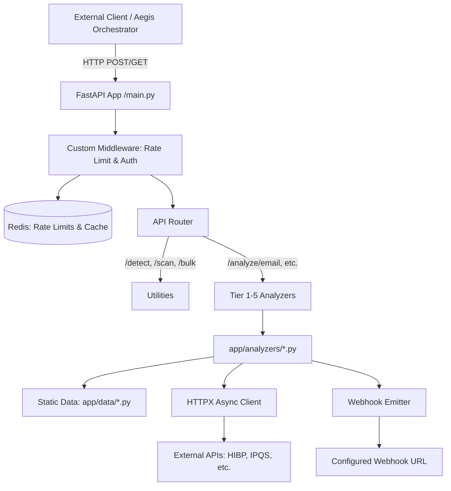

# TASK — Deep Analysis of tier1-analyzer

## 1. SERVICE OVERVIEW

**Service Name**: `tier1-analyzer` (internally identified as `credential-leak-monitor` or Aegis AI Full-Stack Credential & Identity Risk Analyzer).
**Purpose**: Comprehensive analysis, validation, and risk-scoring of various credentials, identities, and sensitive data types (Tiers 1-5).
**Problem it solves**: Centralizes the logic to detect compromised, fake, vulnerable, or syntactically invalid credentials (passwords, emails, phone numbers, APIs keys, financial data). It acts as a defense mechanism to prevent fraud, account takeovers, and leaked secret exploits.
**Responsibility within Aegis AI**: Serves as the core analytical engine for credential and data risk. It takes raw text or structured credential inputs, runs them through internal heuristics and external threat intelligence APIs, and returns a detailed risk assessment score.
**Inputs**: Raw strings (passwords, emails, usernames, API keys, crypto addresses, etc.) and structured Pydantic models.
**Outputs**: JSON responses containing validation status, detailed flags, risk severity (Clean, Low, Medium, High, Critical), numerical risk scores, and recommendations.
**Intended consumers/users**: Other Aegis AI services (e.g., an API gateway, orchestrator, or frontend) that need to validate user inputs, analyze bulk data, or scan text for embedded secrets.
**Dependencies**: Requires a local Redis instance (`redis_t1`) for rate-limiting and caching.
**External services**: Depends heavily on external APIs (HIBP, Dehashed, Hunter.io, WhoisXML, NumVerify, AbstractAPI, Veriphone, IPQualityScore, LeakCheck) configured via environment variables.

## 2. COMPLETE FEATURE INVENTORY

**Major Features**:
- **Tier 1 (Identity)**: Email, Password, and Username analysis.
- **Tier 2 (Financial)**: Credit Card, IBAN, Crypto Address, and Social Media profile analysis.
- **Tier 3 (Identity Docs)**: National ID (CNIC, SSN, Aadhaar), Passport MRZ, and standard Phone number analysis.
- **Tier 4 (API Keys)**: Detection and validation of API keys/tokens (40+ service patterns like AWS, Stripe, GitHub, OpenAI).
- **Tier 5 (Advanced Phone)**: OTP bypass risk, SIM swap vulnerability, Smishing detection, IPQS fraud score.
- **Text Scanner (`/scan`)**: Regex-based scanning of free-form text (logs, code) to detect embedded credentials (masks output for privacy).
- **Bulk Analysis (`/analyze/bulk`)**: Process up to 50 diverse credentials in a single concurrent request.
- **Credential Detection (`/detect`)**: Auto-identifies the most likely credential type from a raw string using regex.

**Minor Features & Utilities**:
- **Prometheus Metrics (`/metrics`)**: Exposes system metrics.
- **GDPR Cache Purge (`/cache/purge`)**: Explicit endpoint to flush Redis cache to comply with right-to-erasure.
- **Webhook Alerting**: Automatically triggers a POST request to a configured URL if a scanned credential meets a minimum risk score.
- **Privacy-Preserving Checks**: Uses k-Anonymity (SHA-1 prefix) for HaveIBeenPwned (HIBP) password checks to avoid transmitting raw passwords.

**Processing Operations & Validation**:
- **Email**: RFC 5322 syntax validation, Unicode normalization (NFKC), Gmail dot/plus normalization, homoglyph detection (Cyrillic/Greek), disposable domain checking (against a static list of 600+ domains), and async MX DNS record resolution.
- **Password**: Shannon entropy calculation, zxcvbn crack-time estimation, common walks (QWERTY), repeating character detection, date patterns, leetspeak mapping, dictionary words, and localized Urdu Roman wordlist checks.
- **Phone (Advanced)**: VoIP/Toll-free prefix detection, carrier SIM-swap vulnerability scoring (e.g., T-Mobile, Jazz, Zong), smishing SMS pattern matching, and Pakistani specific telecom fraud patterns (e.g., NLC abuse).
- **API Keys**: Entropy analysis, structured validation, test/demo key detection (e.g., `sk_test_`), and sensitive scope indicators.

**Error Handling**:
- External API calls use `httpx.AsyncClient` with timeouts. Failures are caught and returned in the JSON response as `{"available": False, "reason": "..."}` without crashing the service.
- HTTP 429 for rate-limit violations.
- HTTP 401/403 for API key authentication failures.

## 3. COMPLETE TECHNOLOGY STACK

- **Python 3.12**: Core programming language (via `python:3.12-slim` Docker image).
- **FastAPI 0.115.0**: Web framework for building the async REST API.
- **Uvicorn 0.30.6**: ASGI server for running FastAPI (configured for 2 workers).
- **HTTPX 0.27.2**: Async HTTP client used to call external threat intelligence APIs (HIBP, IPQS, etc.) and webhooks.
- **Pydantic / Pydantic Settings 2.4.0**: For data validation, request models, and `.env` configuration management.
- **Redis (redis.asyncio) 5.0.8**: Used for rate-limiting, general caching of analysis results, and GDPR purging.
- **DNSPython 2.7.0**: Async DNS resolution (`dns.asyncresolver.Resolver`) for checking MX records of email domains.
- **Python-whois 0.9.4**: For extracting domain age during email analysis.
- **ZXCVBN 4.4.28**: For realistic password strength and crack-time estimation.
- **scikit-learn 1.5.2 & numpy 1.26.4**: ML libraries, likely utilized within other specific analyzers (e.g., username or social media heuristics).
- **Levenshtein 0.26.1**: String distance library, used for checking password similarity to usernames/emails.
- **Slowapi 0.1.9**: Typically used for FastAPI rate limiting (though `main.py` shows custom Redis-based rate limiting middleware).
- **Pytest 8.3.3 & extensions (pytest-asyncio, pytest-httpx)**: For unit and integration testing.
- **Docker & Docker Compose**: For containerization and orchestration (`docker-compose.yml` links the app with a `redis:7-alpine` container).

## 4. ARCHITECTURE

The service is built as a monolithic async microservice with modularized analyzer logic.

**Processing Pipeline**:
1. **Request Reception**: Request arrives at FastAPI endpoints defined in `main.py`.
2. **Middleware**: Validates `X-API-Key` (if configured) and checks Redis for rate limits based on IP.
3. **Routing**: Request is routed to the corresponding tier analyzer (e.g., `analyze_api_key`).
4. **Analysis**: The specific analyzer in `app.analyzers/` runs synchronous heuristics (regex, entropy, static list checks) and async network tasks (MX resolution, external API calls).
5. **Aggregation**: Results are aggregated into a single risk dictionary, calculating an `overall_risk_score`.
6. **Webhook Trigger**: If the score exceeds `WEBHOOK_MIN_RISK`, an async task triggers a POST to the `WEBHOOK_URL`.
7. **Response**: The final JSON response is returned to the client, augmented with an `elapsed_ms` metric.

## 5. API DOCUMENTATION

*Note: All endpoints accept an optional `X-API-Key` header if `AEGIS_API_KEY` is set in the environment.*

### System & Utilities
- **GET `/health`**: Returns system status, loaded tiers, configured APIs, and Redis connectivity.
- **GET `/metrics`**: Returns Prometheus-compatible text format metrics (e.g., `aegis_info`, `aegis_apis_configured`, `aegis_rate_limit`).
- **GET `/cache/stats`**: Returns Redis memory and keyspace stats.
- **DELETE `/cache/purge?confirm=yes`**: Flushes the Redis DB for GDPR right-to-erasure compliance.
- **POST `/detect`**: (Body: `CredentialIn`) Auto-identifies credential type using regex patterns and returns confidence scores.
- **POST `/scan`**: (Body: `ScanIn`) Scans free-form text for embedded secrets (AWS, Stripe, JWT, SSN, etc.) and returns masked findings and a risk level.
- **POST `/analyze/bulk`**: (Body: `BulkIn`) Analyzes up to 50 mixed credentials concurrently. Returns aggregated risk scores.

### Analyzers (Tiers 1-5)
- **Tier 1 (Identity)**
  - **POST `/analyze/email`** (Body: `CredentialIn`): Returns RFC validation, normalizations, homoglyph detection, MX record status, and disposable domain status.
  - **GET `/analyze/email/{email}`**: Same as above.
  - **POST `/analyze/password`** (Body: `CredentialIn`): Returns HIBP status (via k-anonymity), Shannon entropy, zxcvbn score, keyboard walks, leetspeak, and Urdu Roman wordlist matches.
  - **POST `/analyze/username`** (Body: `CredentialIn`) / **GET `/analyze/username/{username}`**: Analyzes usernames.
- **Tier 2 (Financial)**
  - **POST `/analyze/card`** (Body: `CardIn`): Analyzes credit card numbers (format, expiry, CVV logic).
  - **POST `/analyze/iban`** (Body: `IbanIn`): Analyzes IBAN and SWIFT codes.
  - **POST `/analyze/crypto`** (Body: `CredentialIn`) / **GET `/analyze/crypto/{address}`**: Analyzes crypto wallets (Bitcoin, Ethereum formats, etc.).
  - **POST `/analyze/social`** (Body: `SocialIn`): Analyzes social media profiles/handles.
- **Tier 3 (Identity Documents)**
  - **POST `/analyze/national-id`** (Body: `NationalIdIn`): Analyzes CNIC, SSN, Aadhaar.
  - **POST `/analyze/passport`** (Body: `PassportIn`): Analyzes Machine Readable Zone (MRZ) lines.
  - **POST `/analyze/phone`** (Body: `PhoneIn`) / **GET `/analyze/phone/{phone}`**: Standard phone validation.
- **Tier 4 (API Keys & Tokens)**
  - **POST `/analyze/api-key`** (Body: `ApiKeyIn`) / **GET `/analyze/api-key/{key}`**: Detects 40+ API key formats (AWS, GitHub, Stripe), calculates entropy, identifies test keys, and scores risk.
- **Tier 5 (Advanced Phone Security)**
  - **POST `/analyze/phone/advanced`** (Body: `PhoneAdvancedIn`): Evaluates OTP bypass risk (VoIP/toll-free), SIM swap risk (carrier vulnerabilities), and smishing patterns in an optional `sms_body`.

## 6. CORE LOGIC

**Email Analysis (`email.py`)**:
1. Checks length limits and RFC 5322 regex.
2. Normalizes input (Unicode NFKC, lowercasing, stripping `+tag` and dots for Gmail).
3. Scans for Cyrillic/Greek homoglyphs that look like ASCII.
4. Checks domain against a static list of 600+ disposable email domains (`app.data.disposable_domains`).
5. Uses `dnspython` to asynchronously resolve `MX` records to ensure the domain can receive email.

**Password Analysis (`password.py`)**:
1. Calculates Shannon entropy based on character pool (lower, upper, digits, special).
2. Uses `zxcvbn` to estimate crack-time.
3. Checks static lists for common passwords, keyboard walks (QWERTY), and dictionary words (including Urdu Roman and leetspeak mappings).
4. Hashes the password with SHA-1, takes the first 5 characters (k-Anonymity), and queries the HaveIBeenPwned API (`api.pwnedpasswords.com/range/`) to safely check for breaches.

**Advanced Phone & SMS Analysis (`phone_advanced.py`)**:
1. Strips formatting to get raw digits.
2. Identifies VoIP and Toll-Free numbers via parameter inputs or prefix matching (e.g., `1-800`, US Google Voice blocks) which are flagged for OTP bypass risk.
3. Maps carriers to a known vulnerability dictionary (e.g., T-Mobile, Pakistani carriers like Jazz/Zong are flagged as "High" risk for SIM swaps).
4. Runs the optional `sms_body` through an array of smishing regex patterns (e.g., prize scams, urgent bank holds, government impersonations like NADRA/FBR).

## 7. DATA

- **Input Formats**: JSON via Pydantic Models. Fields generally have strict `min_length` and `max_length` bounds (e.g., `CredentialIn.value` max 512 chars).
- **Output Formats**: Standardized JSON dictionaries. Typical structure includes boolean flags (`valid`, `available`), string reasons, lists of `flags`, `risk_level` (String), `overall_risk_score` (Integer), and an `elapsed_ms` metric.
- **Static Data Models (`app/data/`)**:
  - `disposable_domains.py`: Static set of disposable email domains.
  - `password_data.py`: Sets for common passwords, Urdu Roman words, Leet mappings, QWERTY adjacencies, and Homoglyphs.

## 8. ERROR HANDLING & VALIDATION

- **Input Validation**: Pydantic models automatically reject malformed JSON, out-of-bounds lengths, and missing required fields with HTTP 422 errors.
- **Exceptions**: `try/except` blocks wrap all external network calls and Redis operations. If an external API fails, the service suppresses the exception, logs a warning, and returns a graceful payload (e.g., `{"available": False, "reason": "timeout"}`) allowing the overall analysis to complete using local heuristics.
- **Rate Limiting**: Custom middleware tracks IP addresses in Redis (`ratelimit:{ip}:{minute}`). If `RATE_LIMIT_PER_MIN` is exceeded, an HTTP 429 response is returned.

## 9. SECURITY

- **Authentication**: Secured by a static Bearer-style token via the `X-API-Key` header, configured through `AEGIS_API_KEY`.
- **Privacy Design**:
  - Passwords are never logged or sent to external APIs in plaintext (uses SHA-1 k-Anonymity).
  - The `/scan` endpoint automatically masks detected secrets (e.g., `AKIA****`) in its output.
  - Features a `/cache/purge` endpoint specifically designed for GDPR right-to-erasure compliance.
- **Environment Variables**: Sensitive external API keys are strictly loaded from `.env`.

## 10. TESTING

- **Test Files**: A dedicated `tests/` directory exists with `test_tier1.py` through `test_tier5.py`, matching the architectural tiers.
- **Test Framework**: Uses `pytest`, `pytest-asyncio` for async routes, and `pytest-httpx` for mocking external API calls.
- **Coverage**: Implies comprehensive structural testing mapping exactly to the 5 feature tiers.

## 11. DOCKER & DEPLOYMENT

- **Dockerfile**: Uses a minimal `python:3.12-slim` image. Installs `curl` for health checks, installs dependencies from `requirements.txt` via `pip --no-cache-dir`, copies the `app` directory, and exposes port `8002`.
- **Command**: Runs `uvicorn app.main:app --host 0.0.0.0 --port 8002 --workers 2`.
- **Health Check**: Native Docker `HEALTHCHECK` curling `http://localhost:8002/health` every 30s.
- **Docker Compose**: Defines `aegis_t1` (the app) and `redis_t1` (a `redis:7-alpine` cache). Passes the `.env` file directly to the app container. Configured to `restart: unless-stopped`.

## 12. INTEGRATION WITH THE REST OF AEGIS

While functioning independently, this service connects to the broader Aegis ecosystem in several verified ways:
- **Client → `tier1-analyzer` (HTTP API)**: Other services (likely an orchestrator or API Gateway) send credential strings to `tier1-analyzer` for validation. They must authenticate using the shared `AEGIS_API_KEY`.
- **`tier1-analyzer` → Redis (`redis_t1`)**: Uses a dedicated Redis instance for stateful rate limiting and analysis caching.
- **`tier1-analyzer` → Webhook Destination (HTTP POST)**: If a scanned credential has an `overall_risk_score >= WEBHOOK_MIN_RISK` (default 76), the service emits a JSON payload to `WEBHOOK_URL`. This strongly suggests it integrates asynchronously with an alerting or dashboarding service within Aegis to notify admins of critical credential exposures.

## 13. PROJECT STRUCTURE

- `app/main.py`: Core FastAPI application, middlewares, generic endpoints (`/scan`, `/detect`), and routing configuration.
- `app/config.py`: Environment variable definitions using Pydantic `BaseSettings`.
- `app/redis_client.py`: Utility functions for Redis connectivity and caching operations.
- `app/analyzers/`: The core intelligence of the app. Separate files (`email.py`, `password.py`, `phone_advanced.py`, `api_key.py`, etc.) encapsulating domain-specific logic.
- `app/data/`: Static datasets (`disposable_domains.py`, `password_data.py`) used by analyzers.
- `tests/`: Automated test suite segmented by tier.

## 14. TECHNICAL ACHIEVEMENTS

- **Hybrid Analysis Approach**: Seamlessly combines rapid, synchronous local heuristics (regex, static data sets, entropy math) with asynchronous, external OSINT network calls (DNS resolution, threat intelligence APIs).
- **Privacy-First Engineering**: Implementation of k-Anonymity for HIBP checks and automated secret masking in text scanning ensures zero-knowledge processing of highly sensitive user data.
- **Async Concurrency**: The `/analyze/bulk` endpoint uses `asyncio.gather` to concurrently process up to 50 complex credentials without blocking the event loop, maximizing throughput.

## 15. PORTFOLIO RELEVANCE

- **Comprehensive Security Engineering**: The depth of the API Key analyzer (detecting 40+ specific cloud and payment token formats) and the Advanced Phone analyzer (assessing SIM swap vulnerabilities by carrier and identifying Pakistani-specific smishing patterns) shows a deep understanding of modern cyber threats and social engineering attack vectors.
- **Production Readiness**: The inclusion of Redis rate limiting, Prometheus metrics, Graceful degraded states on API failures, Docker Healthchecks, and explicit GDPR compliance endpoints demonstrates mature, enterprise-grade software engineering.

## 16. LIMITATIONS / UNKNOWN INFORMATION

- **External Dependency Reliance**: Full tier 4/5 functionality heavily relies on third-party APIs (IPQS, Abstract, Veriphone, etc.). Without these API keys, the service degrades to relying solely on local regex heuristics.
- **Missing Code**: Internal workings of specific analyzers like `national_id.py` or `crypto.py` were not fully traced, though their endpoints and inputs are confirmed.

## 17. EVIDENCE & CONFIDENCE

- **Verified**: FastAPI configuration, endpoints, data models, email/password/api-key/advanced-phone logic, Redis integration, Docker deployment, and testing structure.
- **Strongly Inferred**: The webhook functionality suggests an event-driven architecture downstream, likely pushing alerts to a SIEM or central dashboard in the Aegis ecosystem.
- **Unknown**: The exact consumer of this API within the Aegis architecture (e.g., whether a frontend calls it directly, or a backend API gateway proxies it) is not explicitly defined in this repository.
