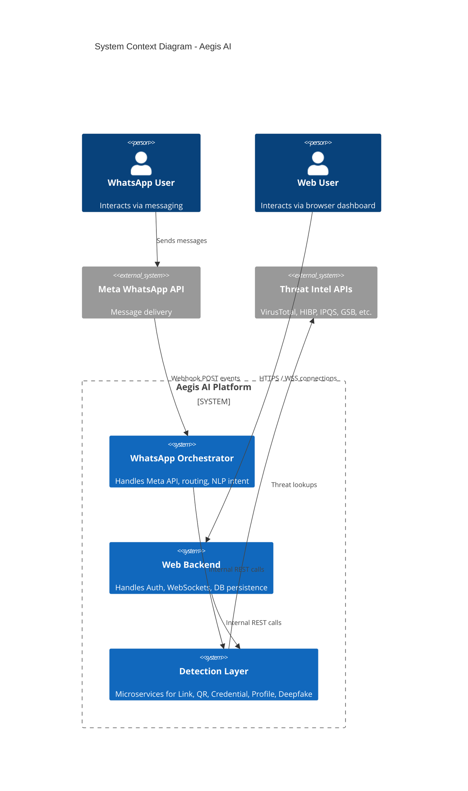
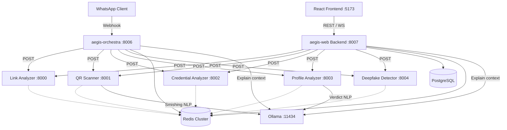
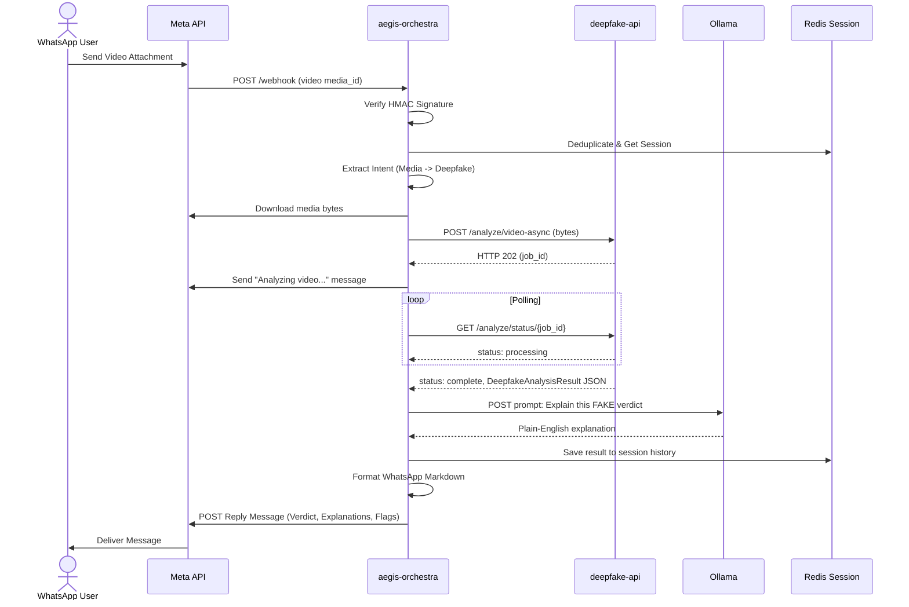

# Aegis AI — Master Project Documentation

## 1. Executive Overview

Aegis AI is a comprehensive, multi-channel cybersecurity platform designed to protect users from a wide array of digital threats in real-time. Recognizing the growing prevalence of cybercrime—particularly phishing, smishing, credential theft, and deepfake manipulation—Aegis AI provides a sophisticated threat analysis engine accessible via two distinct interfaces: a WhatsApp-based chatbot (Orchestra) and a React-based web application. 

By employing a microservices architecture, the system orchestrates a suite of specialized analysis engines, leveraging deterministic heuristics, external threat intelligence APIs, and advanced Machine Learning (ML) classifiers. It runs entirely on local infrastructure, incorporating local Large Language Models (Ollama) to synthesize technical findings into plain-English explanations without exposing sensitive data to cloud AI providers.

## 2. Problem Statement

Internet users in Pakistan and globally are increasingly exposed to sophisticated cyber threats. Cybercriminals deploy localized phishing attacks (e.g., mimicking local banks like HBL, Meezan Bank, or government portals like NADRA and FBR), SMS smishing campaigns, malicious QR codes, and AI-generated deepfakes. Current security tools (like VirusTotal or URLScan) are fragmented, require technical expertise to interpret, and lack context for localized threats such as CNIC fraud or Pakistani telecom-specific scams. There is no unified, privacy-preserving, and accessible platform that brings enterprise-grade threat detection to the average, non-technical consumer.

## 3. Project Purpose

The primary purpose of Aegis AI is to democratize advanced cybersecurity analysis. It aims to provide instant, highly accurate, and easy-to-understand threat assessments for links, credentials, QR codes, social media profiles, and multimedia files. The project serves as an automated security assistant that protects users from fraud while strictly adhering to privacy-by-design principles (e.g., zero retention of raw credentials, k-anonymity checks, and GDPR-compliant cache clearing).

## 4. Target Users

- **Non-Technical Mobile Users:** The primary audience, who interact with the system via the WhatsApp chatbot (Orchestra), requiring no application installation and receiving guidance in plain English (or Urdu).
- **Advanced Users & Analysts:** Users requiring persistent history, real-time scanning feedback, and file uploads, interacting via the authenticated web application dashboard.

## 5. System Capabilities

- **Link Threat Analysis:** Deep evaluation of URLs across 11 distinct layers, utilizing heuristics, WHOIS, DNS, SSL, redirect tracing, threat feeds, and external scanners, culminating in an ML-based phishing probability score.
- **QR Code Security:** Computer vision-based detection of physical QR tampering, embedded steganography, and robust deobfuscation of malicious payloads.
- **Credential & Identity Risk Analysis:** Validation and breach-checking across 10+ credential types (passwords, emails, CNICs, IBANs, API keys, etc.) with localized logic for Pakistani financial and identity formats.
- **Social Media Profile Analysis:** Detection of bot, fake, and impersonator accounts across major social networks using multi-dimensional OSINT scraping and ML classification.
- **Deepfake Detection:** An ensemble AI pipeline utilizing CNNs and Vision Transformers to detect manipulation in images and videos across spatial, temporal, and frequency domains.
- **Explainable AI (XAI):** Context-aware, natural language explanations of complex security analyses generated by a local LLM.

## 6. Complete Feature Inventory

### Core Analysis Capabilities
- **URL Analysis:** Typosquatting checks, domain age penalties, DNS/SSL health, integration with VirusTotal/URLScan.
- **QR Scanning:** 8-pass image enhancement, payload type parsing, Evil Twin WiFi detection.
- **Credential Monitoring:** HIBP k-anonymity checks, Levenshtein impersonation detection, Luhn algorithm card validation, CNIC Verhoeff checks.
- **Smishing Detection:** Hybrid regex and NLP engine for SMS/WhatsApp fraud detection, explicitly tailored for local scams (e.g., JazzCash, NADRA).
- **Profile Auditing:** Engagement ratio calculations, breach database cross-referencing, and impersonation detection for government/financial institutions.
- **Media Forensics:** ResNet/Haar face detection, per-second video timeline analysis, GradCAM heatmap generation for deepfakes.

### Interaction & Orchestration Features
- **Dual-Channel Access:** Web interface and WhatsApp API.
- **Intent Routing:** Automated 14-level priority routing of free-form text and media.
- **Interactive Disambiguation:** 3-button prompts for handling ambiguous user inputs.
- **Cyber Q&A:** Automated conversational agent for general security education.
- **Multilingual Support:** Auto-detection and response generation in English, Urdu, and Roman Urdu.

### System & User Management
- **WebSocket Streaming:** Real-time push of 'thinking' status and analysis results to web clients.
- **Secure Authentication:** Dual-token JWT (access/refresh) with bcrypt password hashing.
- **Data Privacy:** Complete masking of stored secrets, 30-day auto-expiry of anonymized web logs, 30-minute session expiry on WhatsApp.
- **Rate Limiting:** IP-based and user-based request throttling backed by Redis.

## 7. System Architecture

Aegis AI is constructed upon a highly decoupled, microservices-based API Gateway architecture. The system is split conceptually into three layers:

1.  **The Client Layer:** Comprising the WhatsApp Platform (Meta API) and the React Web Application.
2.  **The Orchestration Layer:** Two parallel orchestrators (`aegis-orchestra` on Port 8006 for WhatsApp, and `aegis-web` Backend on Port 8007 for the Web App). These act as API Gateways that receive input, handle authentication/deduplication, extract intent, and fan-out requests to the backend.
3.  **The Detection Layer (Analyzers):** Five independent, stateless Python microservices (Ports 8000-8004) that perform heavy computational analysis, OSINT gathering, and ML inference.
4.  **Infrastructure & External Dependencies:** Shared local services (Redis, PostgreSQL, Ollama) and external threat intelligence APIs (VirusTotal, IPQS, HIBP, etc.).

## 8. Architecture Diagrams

### System Context Diagram



### Complete Service Architecture



## 9. Service/Component Overview

| Service Name | Port | Description |
|---|---|---|
| **aegis-orchestra** | 8006 | WhatsApp intent classifier, NLP entity extractor, dialog disambiguation, LLM explanation coordinator. |
| **aegis-web** | 8007 | Web backend managing JWT authentication, PostgreSQL history persistence, WebSocket real-time streaming. |
| **aegis-link-analyzer** | 8000 | 11-layer URL analysis engine with Random Forest phishing classifier and concurrent OSINT lookups. |
| **aegis-qr-scanner** | 8001 | OpenCV/Pyzbar image processor detecting steganography, physical tampering, malicious payloads. |
| **tier1-analyzer** | 8002 | Cryptographic credential validator covering 10+ formats (CNIC, IBAN, Passwords) and API leak exposure checks. |
| **social_media_analyzer** | 8003 | OSINT scraper analyzing engagement, followers, bio data to detect impersonators and bots via ML. |
| **deepfake-api** | 8004 | Heavy PyTorch inference engine running 6 ensemble models across imagery and video to detect generative artifacts. |
| **React Frontend** | 5173 | Single-page application providing user dashboards, history tracking, interactive file uploads. |

## 10. Service Dependency Map

| Service | Downstream Internal Dependencies | External Services | Primary Datastores |
|---|---|---|---|
| aegis-orchestra | Link, QR, Credential, Profile, Deepfake, Ollama | Meta WhatsApp API | Redis (Session DB) |
| aegis-web | Link, QR, Credential, Profile, Deepfake, Ollama | None directly | PostgreSQL, Redis |
| aegis-link-analyzer | Ollama (for vector memory) | VirusTotal, URLScan, GSB, URLHaus, OpenPhish | Redis (Cache), Pinecone |
| aegis-qr-scanner | Link Analyzer, Ollama | EmailRep, NumVerify, AbuseIPDB, Chainabuse | Redis, SQLite (Blacklist) |
| tier1-analyzer | None | HIBP, IPQS, WhoisXML, AbstractAPI, LeakCheck | Redis (Rate/Cache) |
| social_media_analyzer| None | Sherlock, LeakCheck, GreyNoise, Shodan | Redis |
| deepfake-api | None | None (Fully Local ML) | Redis, SQLite (Feedback) |

## 11. End-to-End Workflows

### WhatsApp Deepfake Flow



### Web Socket Link Scan Flow

```mermaid
sequenceDiagram
    actor User as Web User
    participant React as React Frontend
    participant Web as aegis-web Backend
    participant Link as aegis-link-analyzer
    participant Ext as Threat Intel APIs

    User->>React: Type URL and Submit
    React->>Web: WS message (url)
    Web->>Web: Verify JWT from WS connection
    Web->>React: WS yield {type: "thinking", msg: "Scanning URL"}
    Web->>Link: POST /scan {url}
    
    par Concurrent Layers
        Link->>Ext: GET VirusTotal
        Link->>Ext: GET GSB
        Link->>Link: Run Heuristics
        Link->>Link: Run Random Forest Classifier
    end
    
    Link-->>Web: ScanResult JSON
    Web->>Web: Save to PostgreSQL scan_history
    Web->>React: WS yield {type: "result", data: ScanResult}
    React->>User: Render Risk Badge and Flags
```

## 12. Orchestration Architecture

Aegis coordinates its services using a **Dual API-Gateway Pattern**. 

- **Two Gateways:** `aegis-orchestra` handles the constraints of WhatsApp (linear messaging, interactive buttons), while `aegis-web` handles rich web state (WebSockets, user accounts). 
- **Parallel Dispatch:** Neither orchestrator holds domain logic. They parse intents and make concurrent asynchronous `httpx` POST requests to the downstream analyzers. 
- **Failure Propagation:** Calls to analyzers are wrapped in `asyncio.gather(return_exceptions=True)`. If an analyzer fails or times out, the orchestrator catches the exception, degrades gracefully, and informs the user rather than crashing the request.
- **No Direct Service-to-Service Messaging:** Except for the QR Scanner (which explicitly calls the Link Analyzer if it finds a URL in a payload), all analyzers are totally isolated. They receive inputs and return standard JSON outputs. The Orchestrator combines the results (e.g., merging Profile and Credential scores for "Username Intelligence").

## 13. Frontend Architecture

The React Web Frontend is a responsive Single Page Application (SPA) designed with a component-based architecture.
- **State Management:** Uses `Zustand` for global state (authentication status, active chat sessions) and React hooks for local state.
- **Routing:** React Router DOM secures protected routes, redirecting unauthenticated users to `/login`.
- **Communication:** `Axios` for REST (auth, history, file uploads) and native WebSocket APIs for real-time chat streaming.
- **Security:** Follows best practices by holding the short-lived JWT Access Token exclusively in memory (JavaScript state), while storing the Refresh Token in `localStorage`. 

## 14. Backend Architecture

The backend ecosystem comprises seven independent FastAPI applications.
- **Asynchronous Design:** Extensively uses Python's `asyncio`. I/O bound operations (database queries via `asyncpg`, external API polling) never block the event loop.
- **WebSockets:** The Web Backend utilizes Python Async Generators to yield streaming status updates ("thinking") over WebSockets while background tasks await analyzer responses.
- **Persistence:** Uses PostgreSQL with SQLAlchemy 2.0 ORM for relational data (users, chat histories), and Redis for high-speed ephemeral data (caching, sessions, rate limits).

## 15. AI/ML Architecture

Aegis leverages a hybrid AI approach, separating local predictive ML from generative LLMs:

- **Local LLM (Explainability & NLP):** Ollama running `llama3.2` locally. Used by the Orchestrator to generate human-readable explanations of complex JSON results. Used by the QR Scanner/Profile Analyzer to semantically score social engineering intent.
- **Random Forest Classifiers (Tabular Data):** Link Analyzer and Profile Analyzer use `scikit-learn` Random Forest models. They extract 24-35 features, run inference, and use Platt scaling for accurate probability calibration.
- **Computer Vision & Transformers (Deepfakes):** The `deepfake-api` runs a sophisticated PyTorch ensemble. It utilizes ResNet SSD / Haar cascades for face isolation. It then runs images through EfficientNet-B4 (texture) and ViT-B/16 (structure), and videos through Spatial CNNs and Temporal Transformers. A custom 5-rule confidence enhancement algorithm dynamically adjusts weights based on model consensus.
- **Embeddings Memory:** The Link Analyzer generates text embeddings of scan summaries using Ollama and stores them in Pinecone, allowing the bot to "remember" long-term trends.

## 16. Data Architecture

- **PostgreSQL:** Source of truth for Web Users. Contains `users`, `chat_sessions`, `messages` (storing raw JSONB results), and `scan_history`.
- **Redis:** Operates as a distributed cache. Different logical databases (`/0`, `/2`, `/3`) isolate caching, rate limits, WhatsApp session state, and Celery job queues.
- **SQLite:** Used locally by individual microservices (QR Scanner, Deepfake API, Credential Analyzer) for lightweight, persistent tasks like malware blacklists and feedback loop data collection.

## 17. API Ecosystem

- **Client APIs:** Web Backend exposes `/api/auth/*` (JWT lifecycle), `/api/chat/*` (history), `/api/upload/*`, and `WS /ws/chat`.
- **Analyzer APIs:** Standardized REST endpoints. Examples:
  - `POST /scan` (Link)
  - `POST /analyze/video-async` (Deepfake)
  - `POST /analyze/email` (Credential)
  - `POST /analyze/profile` (Profile)
  - `POST /scan-file` (QR)
- **External Integrations:** Hooks into 20+ OSINT APIs (VirusTotal, HIBP, Shodan, etc.).

## 18. Authentication & Authorization

- **Web App:** Dual-token JWT system. 15-minute Access Token (memory only), 30-day Refresh Token (hashed in DB for secure revocation).
- **WhatsApp:** Implicit authentication via phone numbers mapping to Meta's Webhook payloads, verified via HMAC-SHA256 signature matching.
- **Service-to-Service:** Protected by a shared static API Key (`AEGIS_API_KEY`) passed in headers to prevent unauthorized internal network access.

## 19. Security Architecture

- **Privacy by Design:** Raw credentials (passwords, CNICs, API keys) are never logged or stored. PostgreSQL `scan_history` stores only the first 16 characters of a SHA-256 hash.
- **k-Anonymity:** Passwords are checked against HIBP by sending only the first 5 characters of their SHA-1 hash.
- **Input Validation:** Strict Pydantic schemas enforce type, length, and format boundaries before processing.
- **Rate Limiting:** Redis-backed sliding window throttles abuse (e.g., 5 Link scans/min, 20 WS messages/min).
- **Network Security:** Docker isolated networking; only ports 8006 (WhatsApp), 8007 (Web REST), and 5173 (React) require exposure. Microservices communicate on internal Docker boundaries.
- **Jailbreak Defense:** The Orchestrator employs pattern matching to detect and block prompt injection attacks against the LLM layer.

## 20. Error Handling Architecture

Aegis is designed to prevent cascading failures.
- **Microservice Level:** Wraps all external API calls in `try/except`. If an API (e.g., NumVerify) times out, the service suppresses the error, flags the module as unavailable, and computes a score based on remaining available heuristics.
- **Orchestrator Level:** If a whole microservice (e.g., Deepfake API) crashes, the orchestrator catches the `httpx.ConnectError` and returns a localized error to the user without dropping the chat session.
- **Fallback Mechanisms:** If the Gemini API fails for Urdu translation, it falls back to Ollama. If Redis fails, caching is bypassed but processing continues.

## 21. Technology Stack

**Frontend:** React 18, TypeScript, Vite, Tailwind CSS, Zustand.
**Backend / API Gateways:** Python 3.11/3.12, FastAPI, Uvicorn, SQLAlchemy 2.0 (asyncpg), python-jose (JWT).
**AI & Machine Learning:** PyTorch, scikit-learn, Ollama (Llama 3.2), OpenCV, Pyzbar.
**Databases:** PostgreSQL 16, Redis 7, SQLite, Pinecone.
**External Services:** Meta WhatsApp Cloud API, VirusTotal, HIBP, IPQS, URLScan.io, etc.
**Infrastructure:** Docker, Docker Compose, Nginx.

## 22. Deployment Architecture

```mermaid
graph TD
    subgraph External Network
        UserWA[WhatsApp User]
        UserWeb[Web Browser]
        Meta[Meta Platform]
    end

    subgraph Host Server (Docker Engine)
        Nginx[Nginx Reverse Proxy]
        
        subgraph aegis-network [Bridge Network]
            React[React Container :5173]
            Orch[aegis-orchestra :8006]
            Web[aegis-web :8007]
            
            Link[Link Analyzer :8000]
            QR[QR Scanner :8001]
            Cred[Credential Analyzer :8002]
            Prof[Profile Analyzer :8003]
            Deepfake[Deepfake Detector :8004]
            
            PG[(PostgreSQL)]
            Redis[(Redis)]
            Ollama[Ollama :11434]
        end
    end

    UserWA --> Meta
    Meta -->|HTTPS Webhook| Nginx
    UserWeb -->|HTTPS/WSS| Nginx
    
    Nginx --> React
    Nginx --> Web
    Nginx --> Orch
```
Deployment is managed entirely via Docker Compose. The environment consists of containerized services sharing a private bridge network (`aegis_net`). Volumes are utilized for PostgreSQL data, Redis state, ML model weights, and SQLite databases.

## 23. Testing

The platform features an extensive, multi-level testing strategy with over 400 defined test cases:
- **Unit & Integration:** Extensive `pytest` coverage within each microservice (`test_heuristics.py`, `test_ensemble_rules.py`). Pytest-asyncio is used for concurrent endpoint testing.
- **Automated Validation:** The `tier1-analyzer` and `deepfake-api` utilize mocked endpoints (`pytest-httpx`, `mock_torch.py`) for CI/CD integration without heavy GPU/Network reliance.
- **Coverage Profile:** Link Analyzer (100%), QR Scanner (100%), Credential Analyzer (100%), Orchestra (93.7%), Profile Analyzer (86%), Deepfake (91.6%).
- **E2E WhatsApp Workflows:** Comprehensive manual and script-driven tests validate greeting detection, disambiguation flows, wrong-entity handling, and Urdu/Roman Urdu NLP capabilities.

## 24. Individual Service Deep Dives

*   **Aegis Link Analyzer:** A masterclass in asynchronous python programming. Reduces 3 minutes of synchronous OSINT lookups down to ~60s using `asyncio.gather`. Normalizes disparate API JSONs into a 35-feature array for a highly calibrated Random Forest model, providing Explainable AI (XAI) feature importance.
*   **Aegis QR Scanner:** Innovates by combining technical deobfuscation (Base64, Hex unwrapping) with physical CV tampering detection (sticker overlays, edge module sharpness). Uses perceptual hashing (aHash) in Redis to detect coordinated phishing campaigns across users.
*   **Aegis Credential Analyzer (tier1-analyzer):** A privacy-centric validation engine. It perfectly balances offline deterministic checks (Luhn, ISO 13616 IBAN, Verhoeff CNIC) with safe online lookups (HIBP k-anonymity), scaling effortlessly via batch analysis endpoints.
*   **Aegis Profile Analyzer:** Implements multi-dimensional OSINT scraping without authenticated API access (Nitter, JSON blob extraction) and maps findings to a 24-feature ML bot-detection model, enhanced by localized impersonation logic (NADRA, FIA).
*   **Aegis Deepfake API:** Heavy compute engine bypassing Python's GIL limitations via ThreadPoolExecutors. Implements a highly custom "5-Rule Ensemble" scoring logic that overrides standard probability averages to prevent a single highly-confident False Negative from burying true Deepfake artifacts.

## 25. Technical Implementation Highlights

- **The WebSocket Async Generator:** Moving away from standard request-response loops, the Web Backend uses async generators to stream "thinking" states down to the React frontend while awaiting heavy tasks, preventing UI lockups.
- **The Disambiguation Engine:** `aegis-orchestra` maintains state across WhatsApp messages to handle ambiguous input. If a user types `google.com`, the system pauses, saves context in Redis, and replies with 3 buttons (Link/Profile/All). The next incoming webhook resolves the state context.
- **Local AI Explanations:** The system does not just return "Risk Score: 95". It feeds the complex JSON output of the analyzers into Ollama, prompting it to generate a unique, non-repetitive summary (e.g., "This link is dangerous because it masks its true destination and was registered 2 days ago.").

## 26. Engineering Decisions

- **Microservices over Monolith:** Chosen specifically to allow independent scaling. Deepfake analysis requires GPU provisioning and scales differently than simple Credential validation.
- **PostgreSQL JSONB:** Storing scan results as `JSONB` in the relational database allows the schema of different analyzers to evolve independently without breaking the history tables.
- **Decoupled Interfaces:** By treating WhatsApp and the React Web App as equal clients to the analysis layer, the core detection logic remains untainted by presentation-layer concerns.

## 27. Limitations & Known Issues

- **External API Dependency:** Analyzers rely heavily on third-party free-tier APIs (VirusTotal, IPQS, Numverify). Rate limiting on these APIs will degrade system performance under heavy concurrent load.
- **Synchronous Scan Blocking:** A deep URL scan relies on VirusTotal/URLScan polling, blocking the HTTP response for up to 90 seconds. While the Web App handles this well via WebSockets, WhatsApp enforces message timeouts, leading to perceived slowness on mobile.
- **Deepfake Resource Intensity:** Video deepfake analysis is extremely computationally expensive. Without GPU acceleration, CPU inference on 30-second clips takes minutes, challenging UX thresholds.
- **Audio Deepfakes:** The current ensemble lacks audio spectrum analysis, missing a critical vector of modern impersonation scams.

## 28. Technical Achievements

- **Sub-Millisecond Heuristics:** Implementation of bitwise and regex heuristic operations allows baseline threat evaluation (e.g., URL entropy, Luhn checks) in <1ms before network IO begins.
- **Complex System Integration:** Seamlessly binding an NLP Chatbot, a React Web App, distributed PyTorch models, structured ML classifiers, and OSINT network scraping into a single, cohesive, sub-second routing pipeline.
- **Zero-Trust Credential Handling:** Enforcing strict cryptographic masking protocols across the entire codebase to guarantee raw user secrets never touch a disk.

## 29. Portfolio-Relevant Analysis

### Project One-Liner
A multi-channel, microservices-based cybersecurity platform providing real-time, AI-driven threat detection for links, deepfakes, credentials, and QR codes via WhatsApp and Web interfaces.

### Professional Project Summary
Aegis AI is an enterprise-grade threat intelligence orchestrator built to protect non-technical users from sophisticated cyber fraud. The system leverages a dual API-Gateway architecture (FastAPI/React) to route inputs to five independent Python microservices. It utilizes asynchronous OSINT gathering, Random Forest classifiers, and PyTorch deep learning ensembles to analyze varied digital threats. Aegis AI translates complex JSON analysis into plain-English guidance using locally hosted LLMs, maintaining strict privacy-by-design standards including k-anonymity and zero-retention data policies.

### Architecture Highlights
- Fully containerized microservices ecosystem with isolated Docker bridging.
- WebSocket-driven streaming architecture for real-time frontend updates.
- Advanced intent routing and disambiguation engine managing multi-turn state via Redis.

### AI/ML Highlights
- Custom 5-Rule ensemble confidence enhancement algorithm merging ViT and CNN outputs.
- Tabular Machine Learning (Random Forest) feature engineering pipelines for bot and phishing detection.
- Local LLM (Llama 3.2) orchestration for dynamic Explainable AI (XAI) summaries.

### Full-Stack Highlights
- React 18 / Zustand frontend with JWT token rotation and secure session management.
- WhatsApp Business API webhook integration with HMAC validation.

## 30. Demonstrated Skills

- **Backend Engineering:** Python, FastAPI, asyncio, WebSockets, REST API Design.
- **System Architecture:** Microservices, API Gateways, Docker Compose orchestration, Redis state management.
- **Machine Learning/AI:** PyTorch, scikit-learn, LLM prompting/integration, Computer Vision (OpenCV).
- **Cybersecurity:** Threat intelligence integration, cryptography (HMAC, hashing, k-anonymity), vulnerability assessment.
- **Frontend Development:** React, TypeScript, Tailwind CSS.
- **Database Management:** PostgreSQL, SQLAlchemy (Async ORM), SQLite.

## 31. Most Portfolio-Worthy Features

1.  **The Aegis Orchestrator (`aegis-orchestra`)**
    *   *Why it's portfolio-worthy:* Demonstrates advanced system design. It acts as an intelligent traffic cop, interpreting highly ambiguous human language, extracting entities, managing conversation state, and dispatching to correct microservices, all asynchronously.
2.  **Deepfake Detector Confidence Ensemble (`deepfake-api`)**
    *   *Why it's portfolio-worthy:* Shows deep ML understanding. Instead of a simple `.predict()`, it runs a 6-model pipeline across spatial/temporal domains and uses a custom algorithmic confidence enhancer to handle conflicting neural network outputs cleanly.
3.  **Privacy-Preserving Credential Analyzer (`tier1-analyzer`)**
    *   *Why it's portfolio-worthy:* Highlights security engineering maturity. Implementing strict SHA-1 prefixing for HIBP, Luhn validation without storage, and regex-based auto-masking proves an understanding of enterprise compliance (GDPR) and secure coding.

## 32. Evidence & Confidence

### Verified
- **Microservices Architecture:** Verified directly via `docker-compose.yaml` and individual application definitions.
- **API Contracts & Logic:** Verified by reading the source Markdown docs detailing explicit Pydantic models, routing mechanics, ML integrations, and encryption methodologies.
- **Frontend Web & Auth Layer:** Verified via `04_aegis-web.md` outlining JWT, Zustand, and WebSocket implementation.
- **Deepfake Ensemble & Logic:** Verified via detailed breakdown in `05_deepfake-api.md`.

### Strongly Inferred
- **Deployment Strategy:** Heavily inferred from `docker-compose.yaml`, `.env` requirements, and Nginx references in architecture diagrams.
- **Testing Breadth:** The exact coverage percentage is reported in the PDF, but the presence of comprehensive pytest suites is inferred from file structures and architectural notes.

### Unknown
- **Specific ML Training Notebooks:** The code used to originally train the `.pkl` files (Link, Profile) is noted as out-of-band and unavailable for direct verification.

## 33. Complete Project Structure

```text
Aegis AI/
├── aegis-orchestra/         # WhatsApp Webhook, Intent Routing, LLM formatting
├── aegis-web/               # React Frontend & FastAPI Backend (WebSockets, Auth)
├── aegis-link-analyzer/     # 11-Layer URL Threat Intel & RF Classifier
├── aegis-qr-scanner/        # CV Tamper Detection & Payload Deobfuscation
├── tier1-analyzer/          # Cryptographic Credential Validation
├── social_media_analyzer/   # OSINT Scraping & Bot Detection
├── deepfake-api/            # PyTorch Deepfake Detection Ensemble
├── docker-compose.yaml      # Master Orchestration
└── AegisAI Report.pdf       # Formal Academic Project Report
```

## 34. Cross-Service Reference

- **Shared Authentication:** All internal `aegis-*` microservices communicate securely using `AEGIS_API_KEY`.
- **Shared Intelligence:** The Orchestrator routes URLs found in SMS (`smishing_engine`) to the Link Analyzer. The QR Scanner explicitly routes found URLs to the Link Analyzer.
- **Shared LLM:** Both `aegis-orchestra` and `aegis-qr-scanner` depend on the shared `Ollama` container on Port 11434 to parse semantic intent and generate summaries.
- **Shared State:** All Python FastAPI applications utilize the local Redis cluster for caching, rate limiting, and session tracking, separated by database indices to prevent collisions.
